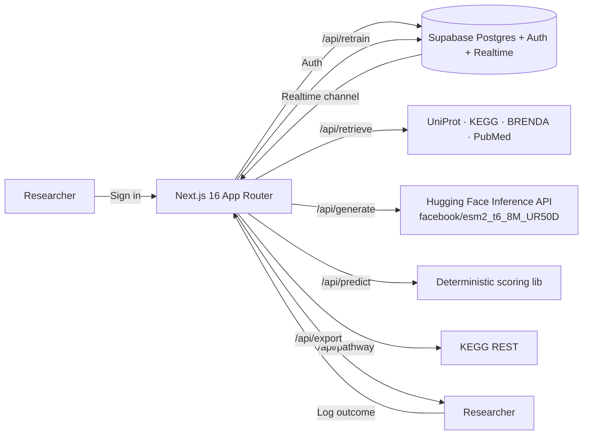

# EnzymeForge.ai

AI-driven discovery for sustainable fuels and chemicals. Researchers enter a target reaction, the platform retrieves known enzymes from UniProt / KEGG / BRENDA, generates novel variants using ESM-2 masked-LM scoring, predicts activity / stability / expression / yield with confidence intervals, designs metabolic pathways, and closes the loop by recalibrating against experimental outcomes.

Built for the GPS Renewables hackathon — the team building India's first ethanol-to-jet-fuel plant.

## Workflow

1. **Retrieve** known enzymes from UniProt / KEGG / BRENDA snapshot for a substrate→product pair (parallel queries, dedupe, persist).
2. **Generate** variant candidates by probing ~20 positions with ESM-2 fillMask, picking top non-wildtype substitutions, composing 5 singles + 3 doubles per parent.
3. **Predict** activity / stability / expression / yield with 95% confidence intervals — deterministic given (sequence, model_version).
4. **Visualize** results: ranked sortable table, activity-vs-stability scatter, 3Dmol.js structure viewer with mutation highlights.
5. **Design pathways** through KEGG reactions (BFS over compound↔reaction graph), with bottleneck identification and intervention suggestions.
6. **Close the loop**: log experimental outcomes, recompute calibration via paired least-squares (slope/intercept per metric), surface hypotheses for recurring underperformer mutations, bump model_version.
7. **Collaborate** via real-time threaded comments (Supabase Realtime), audit log, FASTA / JSON / CSV export.

## Architecture



Stack: **Next.js 16** (App Router, RSC, Turbopack) · **TypeScript strict** · **Tailwind v4** + **shadcn/ui** (base-nova) · **Supabase** (Postgres + Auth + RLS + Realtime + Storage + pgvector) · **Hugging Face Inference** · **Recharts** + **Cytoscape.js** + **3Dmol.js** · **Zod** · **React Hook Form** · **pnpm**.

## Local setup

```bash
# 1. Tooling (Node 20+, pnpm via corepack or brew)
brew install pnpm   # or: corepack prepare pnpm@latest --activate

# 2. Clone & install
git clone <this-repo> EnzymeForge.ai
cd EnzymeForge.ai
pnpm install

# 3. Configure environment
cp .env.example .env.local
# Fill NEXT_PUBLIC_SUPABASE_URL, NEXT_PUBLIC_SUPABASE_ANON_KEY,
# SUPABASE_SERVICE_ROLE_KEY, HUGGINGFACE_API_KEY.

# 4. Apply the migration in Supabase SQL Editor
#    Database → SQL Editor → paste supabase/migrations/0001_init.sql → Run

# 5. (Optional) Seed demo data
pnpm seed

# 6. Run
pnpm dev
# http://localhost:3000
```

### Supabase setup checklist

- Create a project at https://supabase.com/dashboard.
- Database → Extensions → enable `vector` (pgvector).
- SQL Editor → paste and run `supabase/migrations/0001_init.sql`.
- Authentication → Providers → Email is on (default).
- Authentication → "Confirm email" can be **off** for the demo (no inbox required); for production, leave on and the `/auth/callback` flow handles the confirmation link.
- Project Settings → API → copy the URL, anon key, and service-role key into `.env.local`.

### Hugging Face setup

Get a Read token at https://huggingface.co/settings/tokens. ESM-2 (`facebook/esm2_t6_8M_UR50D`) is invoked via `fill-mask` for variant generation — verified working live (~3-5s per probe). Note: feature-extraction is *not* currently routed for ESM-2 by HF Inference Providers as of 2026-05; the prediction layer detects this and degrades gracefully, leaning on MLM scores instead of embedding similarity.

## Demo credentials

After running `pnpm seed`:

```
Email:    demo@enzymeforge.ai
Password: enzymeforge-demo-2026
```

Two demo projects appear under this account:

- **Ethanol → Jet Fuel (C8-C16)** — 5 DB enzymes (ADH1, FabH, ADO, P450 BM3, AdhE) + 6 generated variants + 11 predictions + 8 experiments.
- **CO₂ + H₂ → Methanol** — 4 DB enzymes (FDH, MDH, carbonic anhydrase, RuBisCO) + 6 generated variants + 10 predictions + 8 experiments.

A pre-seeded `model_calibration` row at version `1.0.1` demonstrates the feedback-loop hypothesis surfacing.

## Deploy to Vercel

```bash
# 1. Push to GitHub (or your remote of choice)
git push origin main

# 2. Import the repo in Vercel
#    Add env vars: NEXT_PUBLIC_SUPABASE_URL, NEXT_PUBLIC_SUPABASE_ANON_KEY,
#    SUPABASE_SERVICE_ROLE_KEY, HUGGINGFACE_API_KEY, NEXT_PUBLIC_SITE_URL.
# 3. vercel.json already pins generate / predict / pathway / retrieve /
#    retrain to 60s.
```

## Honesty about what's real vs heuristic

The spec mandated honest labeling — here's the full picture:

| Layer | Implementation | Notes |
|---|---|---|
| UniProt / KEGG / PubMed search | Real REST calls, Zod-typed | KEGG cached per-process for the duration of a request |
| BRENDA | Cached snapshot of 31 enzymes from peer-reviewed literature | Live SOAP wrapper is documented but not implemented; cached values are real (Km, kcat, organism, EC are all cited inline in `brenda-snapshot.ts`) |
| ESM-2 variant generation | **Real** — `fill-mask` against `facebook/esm2_t6_8M_UR50D` | Verified ~3-5s per masked probe; greedy multi-mutation composition |
| ESM-2 embeddings | Soft-fallback to null | HF Inference Providers do not currently expose ESM-2 / ProtBERT for `feature-extraction`; scoring layer ignores the cosine term when null |
| Activity / stability / expression / yield scores | Deterministic heuristics + per-metric calibration | Documented in `src/lib/scoring/predict.ts`. Same input → same output. |
| Confidence intervals | ±15% default, narrowed by sqrt(n_observations) | |
| 3D structure | Real PDB fetch from RCSB via 3Dmol.js | Mutated residues highlighted as green spheres + sticks |
| Pathway flux | BFS over KEGG bipartite graph + bottleneck min-activity | |
| Calibration retrain | Real least-squares fit over paired observations | Bumps semver patch on each retrain |

Every AI output in the UI is labeled with model version and a "demo-grade" tooltip where it applies.

## Roadmap

- ProteinMPNN + ESM-IF for structure-aware variant generation
- FoldX / Rosetta ddG_monomer for proper stability prediction
- Host-specific CAI (E. coli, S. cerevisiae, P. pastoris) for expression
- BRENDA SOAP integration when credentials are configured
- Self-hosted ESM-2 endpoint for embedding-based similarity searches
- Multi-objective optimization (Pareto frontier across activity / stability / expression)

## Development scripts

```
pnpm dev          # Next.js dev server with Turbopack
pnpm build        # production build (typecheck included)
pnpm lint         # ESLint
pnpm typecheck    # tsc --noEmit
pnpm seed         # Insert demo workspace data via service role
pnpm format       # Prettier write
```

## License

Hackathon submission — see LICENSE if present.
